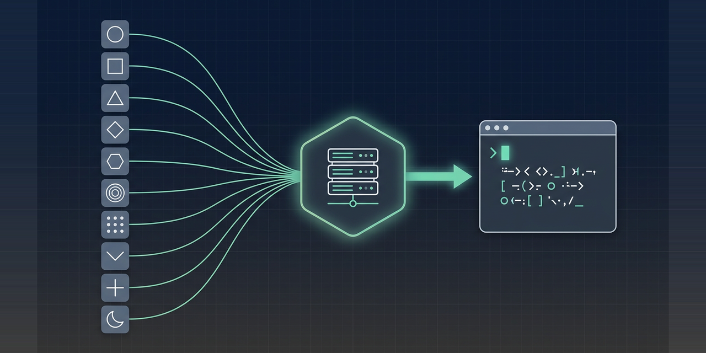

<p align="center">
  
</p>

# Publora Skills: post to 10 social networks from your AI agent

<p align="center">
  
  
  
  
  
  
</p>

**Official skills from the Publora team.** Nine `SKILL.md` files that teach Claude Code, Codex, Cursor, OpenClaw or any skills-aware agent how to publish and schedule posts on LinkedIn, X, Instagram, Threads, TikTok, YouTube, Facebook, Bluesky, Mastodon and Telegram through the [Publora MCP server](https://docs.publora.com/mcp/client-setup).

Your agent drafts, you approve, Publora publishes. One integration instead of ten platform APIs, each with its own auth, media pipeline and rate limits.

## Install

Get an API key at [app.publora.com/dashboard/api](https://app.publora.com/dashboard/api), then connect your agent:

| Client | How |
|---|---|
| **Any agent** (skills CLI) | `npx skills add publora/skills` |
| **Claude Code** | `claude mcp add publora --transport http https://mcp.publora.com --header "Authorization: Bearer sk_YOUR_KEY"` |
| **Claude Code** (plugin) | `/plugin marketplace add publora/skills` |
| **Codex** | add `publora/skills` as a marketplace, then install the `publora-skills` plugin |
| **Cursor** | Settings, MCP, add `https://mcp.publora.com` ([guide](https://docs.publora.com/guides/cursor-ai)) |
| **Claude Desktop** | `~/Library/Application Support/Claude/claude_desktop_config.json` on macOS, `%APPDATA%\Claude\claude_desktop_config.json` on Windows ([snippet](https://docs.publora.com/mcp/client-setup)) |
| **OpenClaw** | [docs.publora.com/mcp/openclaw](https://docs.publora.com/mcp/openclaw) |
| **claude.ai connector** | OAuth, no key needed ([setup](https://docs.publora.com/mcp/client-setup)) |

The free Starter plan covers every platform except X. Current limits and pricing: [publora.com/pricing](https://publora.com/pricing).

## The 9 skills

| Skill | Use it when | It never |
|---|---|---|
| [`linkedin-post`](./skills/linkedin-post/SKILL.md) | the user wants a LinkedIn post, a multi-image grid, a PDF document or an @mention | builds a swipeable carousel, which the API reserves for sponsored content |
| [`linkedin-analytics`](./skills/linkedin-analytics/SKILL.md) | the user asks how a post or the account performed, or wants to react, comment or reshare | calls an analytics MCP tool; statistics are REST only |
| [`x-post`](./skills/x-post/SKILL.md) | the user wants a tweet or a thread auto-split past 280 characters | works on the free plan, since X API costs are passed through |
| [`threads-post`](./skills/threads-post/SKILL.md) | the user wants a Threads post or an image carousel | splits long content into a connected thread, which the platform currently disables |
| [`instagram-post`](./skills/instagram-post/SKILL.md) | the user has a JPEG, a carousel, a Reel or a Story and a Business account | sends PNG, or posts text with no media |
| [`tiktok-post`](./skills/tiktok-post/SKILL.md) | the user has a vertical video for TikTok | promises a public post from an unaudited app, where everything lands private |
| [`telegram-post`](./skills/telegram-post/SKILL.md) | the user wants a channel or group post through a bot | exceeds the 1,024-character media caption or the 50 MB bot video ceiling |
| [`bluesky-post`](./skills/bluesky-post/SKILL.md) | the user wants a 300-character Bluesky post with alt text | uses the account password instead of an app password |
| [`social-post`](./skills/social-post/SKILL.md) | the user targets YouTube, a Facebook Page or Mastodon | posts to a personal Facebook profile, which the API forbids |

## How it works

The MCP server exposes **16 tools**:

**Posts and media** `list_connections`, `list_posts`, `create_post`, `get_post`, `update_post`, `delete_post`, `get_upload_url`, `complete_media`, `delete_media`, `prune_media_reference`

**LinkedIn engagement** `linkedin_create_reaction`, `linkedin_delete_reaction`, `linkedin_create_comment`, `linkedin_delete_comment`, `linkedin_create_reshare`, `linkedin_list_mentionables`

Full signatures: [docs.publora.com/mcp/tools-reference](https://docs.publora.com/mcp/tools-reference).

Three things worth knowing before your agent writes its first call:

- **Media in one call.** Pass up to 10 public https `mediaUrls` to `create_post`. Publora downloads them server-side and attaches them *before* validation, so you can attach media and schedule in a single request instead of running the four-step upload flow.
- **Draft or schedule.** Omit `scheduledTime` and you get a draft. Send a future ISO 8601 UTC time to schedule. A time five or more minutes in the past is rejected.
- **Platform IDs are not guessable.** Call `list_connections` and copy the `platformId` values verbatim.

## REST fallback

Every MCP tool has a REST twin at `https://api.publora.com/api/v1`, authenticated with the `x-publora-key` header rather than a bearer token. Some things are REST only, including LinkedIn statistics and the per-platform `platformSettings` block that controls Instagram video type, TikTok privacy, YouTube visibility, Telegram delivery flags and Threads reply control.

```bash
curl -X GET "https://api.publora.com/api/v1/platform-connections" \
  -H "x-publora-key: sk_your_api_key"
```

Full reference: [docs.publora.com](https://docs.publora.com).

## FAQ

**Does X work on the free plan?**
No. X requires a paid plan because the X API bills per call. Every other platform works on the free Starter plan.

**Can I post a swipeable carousel to LinkedIn?**
Not through the API, which reserves organic carousels for sponsored content. Multi-image posts render as a grid. For swipeable multi-page content, upload a PDF document instead.

**Why did my TikTok video publish as private?**
TikTok forces `SELF_ONLY` for apps that have not passed its audit, whatever `viewerSetting` you send. Ask Publora support about the audited app.

**Why is my Instagram post rejected?**
Instagram's Graph API takes JPEG only, requires a Business account, and refuses text-only posts. PNG uploads fail.

**Can I edit a scheduled post?**
Yes. `update_post` patches `content`, `platforms`, `scheduledTime` and `platformSettings` on a draft or scheduled post, so a typo no longer means deleting and recreating.

**How do I update these skills?**
Run `npx skills add publora/skills` again. What changed is listed in [CHANGELOG.md](CHANGELOG.md) and on the [Releases](https://github.com/publora/skills/releases) page.

## Contributing

Read [CONTRIBUTING.md](CONTRIBUTING.md) first. The short version: these skills must not restate facts that live in the API. No prices, no hand-copied platform limits, no tool that is not in the live `tools/list`. CI enforces all three.

## Related

- [publora/publora-api-docs](https://github.com/publora/publora-api-docs) is the REST and MCP reference these skills follow
- Content-craft bundles built on top of Publora, one per platform: [linkedin-skills](https://github.com/sergebulaev/linkedin-skills), [x-skills](https://github.com/sergebulaev/x-skills), [instagram-skills](https://github.com/sergebulaev/instagram-skills), [threads-skills](https://github.com/sergebulaev/threads-skills), [tiktok-skills](https://github.com/sergebulaev/tiktok-skills), [facebook-skills](https://github.com/sergebulaev/facebook-skills), [youtube-skills](https://github.com/sergebulaev/youtube-skills)

## License

MIT
